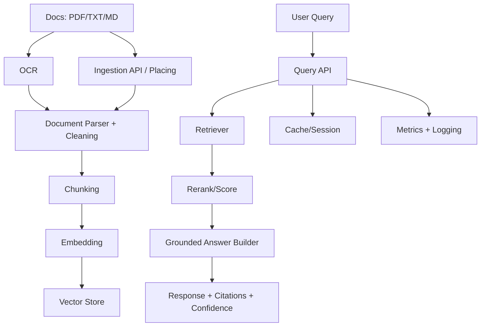

# Local Agentic RAG Architecture

## Diagram

## Komponen
- Ingestion pipeline: menerima path lokal atau upload file, membaca konten, clean, dan indexing incremental.
- Text extraction/cleaning: PDF via `pypdf`, lalu fallback OCR `pytesseract` jika teks native minim; TXT/MD via UTF-8, normalisasi whitespace.
- Chunking strategy: fixed token-window (default 120 kata) dengan overlap 30 untuk menjaga konteks.
- Embedding model: hashing-based dense vector (dim 384) sebagai baseline yang ringan dan local-first.
- Vector database: Milvus Lite sebagai default local vector store, dengan jalur upgrade ke Milvus standalone/distributed.
- Retriever + reranker: cosine similarity top-k, lalu skor dipakai untuk confidence/fallback.
- LLM abstraction: adapter Ollama mengarah ke `http://10.30.50.2:11434`, dengan fallback grounded answer builder saat host/model tidak tersedia.
- Agent/tool-calling layer: tool sederhana query+retrieval; dapat diperluas ke multi-tool agent orchestration.
- API service: FastAPI endpoint `/ingest`, `/query`, `/health`, `/metrics`.
- Cache/session memory: response cache per kombinasi query+top_k di Redis.
- Observability/logging: logging Python + metrik latency, cache hit, total docs/chunks.
- Evaluation pipeline: evaluasi retrieval sederhana via confidence threshold dan source coverage.

## Alur Request Query
1. User kirim `question` + `top_k`.
2. System cek cache.
3. Query di-embed.
4. Retriever ambil top-k chunk paling relevan.
5. Hitung confidence dari skor tertinggi.
6. Jika skor di bawah threshold, fallback aktif.
7. Jika valid, build jawaban grounded dari context chunk.
8. Kembalikan jawaban + citation + confidence + fallback flag.

Sistem ini terdiri dari dua alur utama, yaitu alur ingestion dokumen dan alur query dari user. Pada alur ingestion, dokumen internal seperti PDF, TXT, atau Markdown masuk melalui Ingestion API atau bisa juga dari folder yang sudah ditentukan. Jika dokumen berbentuk scan atau gambar, maka dokumen akan diproses dulu menggunakan OCR agar teksnya bisa diekstrak. Setelah itu, Document Parser akan mengambil isi teks dari dokumen dan melakukan cleaning, seperti membersihkan spasi berlebih, karakter aneh, format yang tidak diperlukan, atau header/footer yang berulang.

Setelah teks berhasil dibersihkan, sistem akan melakukan proses chunking, yaitu memecah dokumen menjadi potongan-potongan kecil agar lebih mudah dicari. Setiap chunk kemudian diubah menjadi embedding, yaitu representasi vector dari teks tersebut. Embedding ini disimpan ke Vector Store bersama metadata seperti nama dokumen, halaman, dan chunk ID. Dengan cara ini, ketika ada pertanyaan dari user, sistem bisa mencari bagian dokumen yang paling relevan berdasarkan makna, bukan hanya berdasarkan kata yang sama persis.

Pada alur query, user mengirim pertanyaan melalui Query API. Sistem akan mengecek cache atau session terlebih dahulu, terutama jika pertanyaan tersebut merupakan pertanyaan lanjutan. Setelah itu, pertanyaan user diproses oleh Retriever untuk mencari chunk paling relevan di Vector Store, lalu hasilnya diranking ulang menggunakan Rerank/Score agar konteks yang dipakai lebih tepat. Chunk terbaik kemudian dikirim ke Grounded Answer Builder untuk membuat jawaban berdasarkan dokumen yang ditemukan. Hasil akhirnya berupa jawaban, citation/source, confidence score, dan fallback jika informasi tidak ditemukan di dokumen. Metrics dan logging juga dicatat untuk memantau performa sistem, seperti jumlah dokumen, jumlah chunk, latency retrieval, cache hit rate, dan error yang muncul.

## Alasan Pilihan Vector DB
- Default local: Milvus Lite memberi persistence file-based dengan API Milvus yang sama.
- Production: `pgvector` cocok jika butuh transaksi dan konsistensi metadata SQL; `Milvus` cocok untuk volume besar/high-throughput ANN.

## Strategi Hallucination
- Citation wajib pada output.
- Confidence threshold untuk fallback.
- Jawaban dibatasi pada context retrieval (grounded generation).
- Jika confidence rendah: tidak memaksakan jawaban.

## Strategi Data Privacy
- Semua parsing/indexing local.
- Tidak wajib kirim dokumen ke API eksternal.
- Jika pakai cloud fallback, payload dapat dibatasi ke chunk terfilter.

## Deployment Local Server
- Jalankan langsung `uvicorn src.main:app --reload` untuk jalankan service di terminal
- `docker compose up --build` untuk docker

## Trade-off Local vs Cloud LLM
- Local: privasi tinggi, biaya inferensi stabil, tapi kualitas model dan latency tergantung hardware.
- Cloud: kualitas model biasanya lebih tinggi dan mudah scale, tapi ada risiko data governance + biaya token.

## Bottleneck Performa
- PDF parsing untuk dokumen besar.
- Embedding/query CPU-bound saat jumlah chunk naik.
- OCR PDF scan menambah latency ingest.
- Single-file Milvus Lite tidak ideal untuk beban multi-node atau jutaan chunk.
