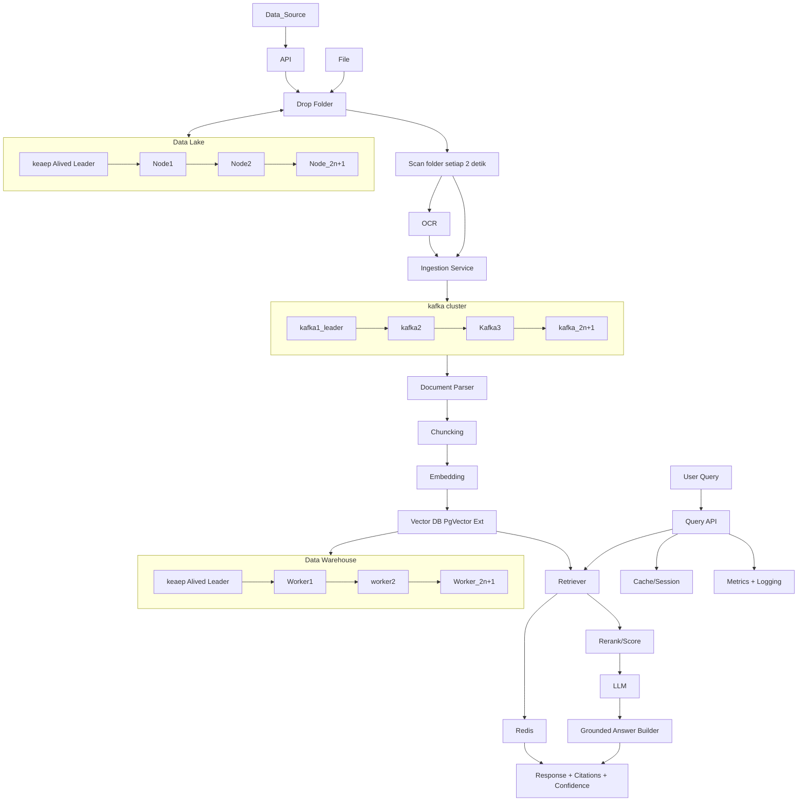

# Scalable Ingestion Design

## Diagram Streaming

## Peran Message Broker
- Kafka sebagai buffer untuk decouple producer-consumer.
- Menjaga query service tetap berjalan saat ingestion mencapai puncak.

## Batch vs Streaming
- Streaming untuk near-real-time updates tiap menit, khusus untuk menjalankan data penting.
- Micro-batch (mis. 30-60 detik) untuk efisiensi embed/index write, mengurangi cost

## Strategi Index Update
- Upsert berdasarkan `doc_id` + `chunk_id` + `embedding_version`.
- Gunakan event delete untuk dokumen yang dicabut.

## Backpressure
- Auto-scale worker berdasarkan lag.
- Limit concurrency parser/embedding.
- Prioritaskan query traffic dengan pool terpisah.

## Failure Handling
- Retry eksponensial untuk error sementara.
- DLQ untuk dokumen korup/unsupported.
- Idempotency key mencegah duplicate indexing.

## Observability
- Kafka lag, ingestion TPS, error ratio, DLQ count.
- Indexing latency end-to-end.
- Consistency checker antara metadata DB dan vector DB.

## Menjaga Consistency Metadata vs Vector
- dengan membuatnya sebagai cluster dan terdistribusi
- dengan Two-phase upsert: tulis metadata `pending`, lalu commit vector, lalu `active`.
- Scheduled reconciliation job untuk mismatch repair.

## Re-index saat Embedding Model Berubah
- Terapkan `embedding_version`
- Re-index blue/green: bangun index baru paralel, swap temporary saat selesai.
- Jalankan background backfill agar query tidak downtime
